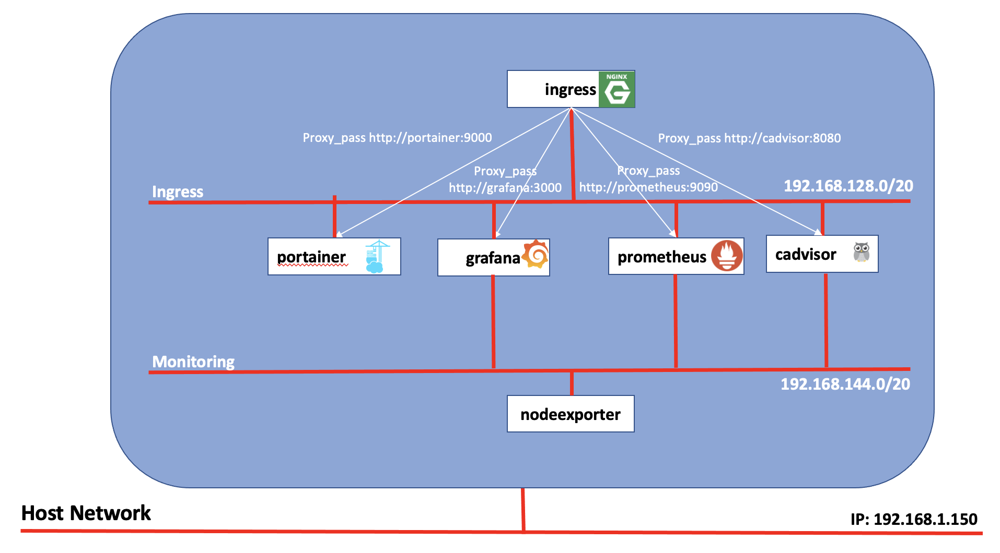

# zCX Monitoring
- [Introduction](#introduction)
- [Setup and run the environment](#setup-and-run-the-environment)
- [Nginx](#nginx)
- [Grafana](#grafana)
- [Prometheus](#prometheus)
- [Cadvisor](#cadvisor)
- [Nodeexport](#nodeexport)
- [Portainer](#portainer)

## Introduction
This repository holds scripts to configure and run monitoring tools for containerized applications on zCX.

All the tools are configured to run behind a Reverse Proxy, implemented with Nginx (https://www.nginx.com/), which shields and concentrates the access to several applications, as seen in the architecture diagram below.

Nginx runs as a container and is configured as a Reverse Proxy, with several *proxy_pass* directives that redirect to the following components running behind the proxy (see [Nginx](#nginx) paragraph for more details):
- [Grafana](#grafana)
- [Prometheus](#prometheus)
- [Cadvisor](#cadvisor)
- [Portainer](#portainer)

Nodeexporter does not have a relevant UI and for this reason runs in the backend and is not exposed through Nginx (see [Nodeexport](#nodeexport) paragraph for more details).

## Setup and run the environment
To run the environment there are few prerequisites that must be met:
- 1 Docker Network **ingress_net**
- 1 Docker Network **monitoring_net**
- 1 Docker Volume **GRAFANA_DATA_VOLUME** used by Grafana container to persist its own data
- 1 Docker Volume **PROMETHEUS_DATA_VOLUME** used by Prometheus container to persist its own data
- 1 Docker Volume **PORTAINER_DATA_VOLUME** used by Portainer container to persist its own data

### 1. Create prerequisites
Run **setup.sh** script to create the prerequisites

### 2. Build custom images
Build the custom Docker image
- run **nginx-docker-build.sh** script to build a custom Nginx image

3. run **run.sh** script to start up all the components delegating to component specific scripts, ran in an ordered manner. Before running this script the first time, there is the need to build the following custom images (scripts and specific configurations are also provided and will be described in the following paragraphs):
        Nginx custom image
        Prometheus custom image
        Node Exporter custom image

      Once you have built these custom images, you can run the script that will start up the whole stack at once in the correct order, as can be seen below.

## Nginx
[TODO]

## Grafana
[TODO]

## Prometheus
[TODO]

## Cadvisor
[TODO]

## Nodeexport
[TODO]

## Portainer
[TODO]